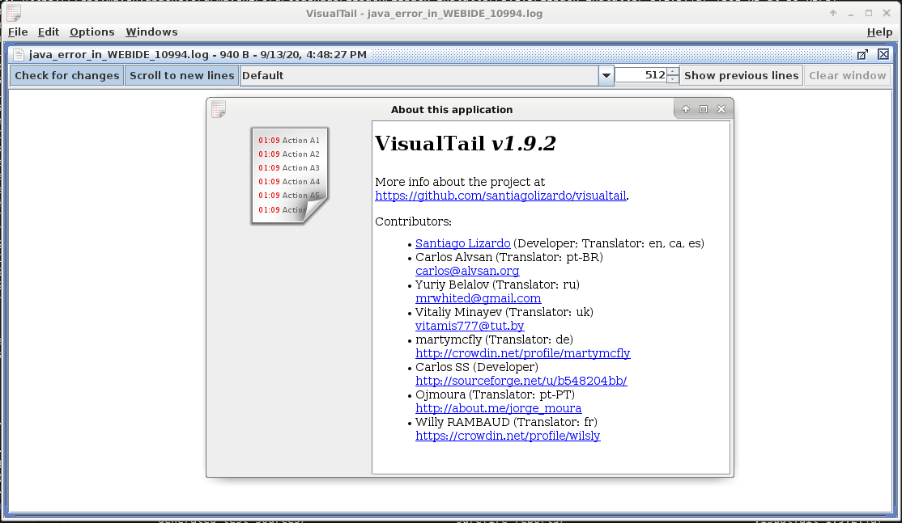

[](https://travis-ci.org/santiagolizardo/visualtail)

# VisualTail



## What is it?

*VisualTail* is an open source graphical log visualizer with syntax highlighting and pattern matching.

### Requirements


  * Java SE 13
  * Graphical user interface

### How to build

```sh
$ mvn package
```

### How to run

```sh
$ java -jar target/VisualTail-1.9.2-jar-with-dependencies.jar 
```

or double click on the jar file using your default file manager.

